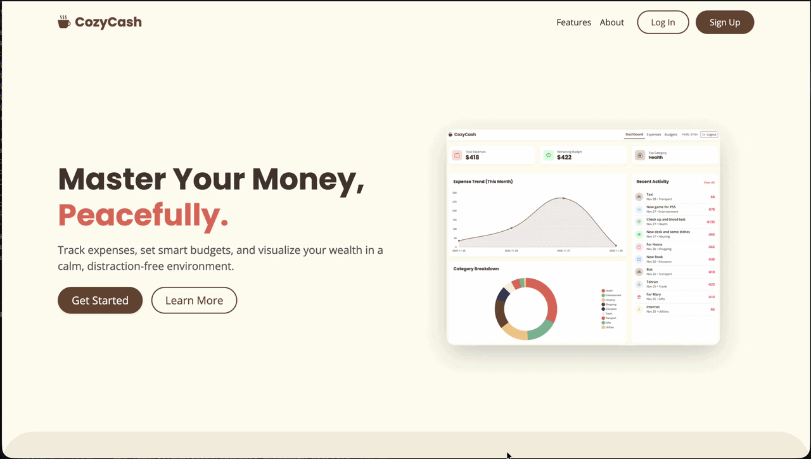

# ☕ CozyCash - Personal Finance & Expense Tracker


A complete, production-ready RESTful API and web application for personal finance management. Built with FastAPI, PostgreSQL, and Docker, CozyCash helps users track daily expenses, set monthly budgets, and analyze spending habits.

> 💡 **Developer's Note:** > My primary focus in this project was engineering the **Backend Architecture, Database Design, and DevOps Infrastructure**. The User Interface (Frontend - HTML/CSS/JS) was developed with the assistance of AI tools to provide a complete and aesthetically pleasing user experience, allowing me to focus on core backend logic, security, and CI/CD automation.

---

<p align="center">
    
</p>

---

## ✨ Features

- **Secure Authentication:** User registration and secure login using OAuth2 and JWT tokens.
- **Expense Management:** Full CRUD operations for daily transactions with category and date filtering.
- **Smart Budgeting:** Set monthly budget limits per category with visual progress bars and dynamic health statuses.
- **Interactive Dashboard:** Real-time analytics and data visualization (Spending Trends & Category Breakdowns).
- **Automated Infrastructure:** Multi-stage Docker builds with intelligent entrypoint scripts for seamless setups.
- **Enterprise-Grade Testing:** Comprehensive Pytest suite utilizing transaction rollbacks and automated test-database generation for isolated testing.
- **CI/CD Pipeline:** Fully automated integration and deployment workflow via GitHub Actions (auto-tests & Docker Hub pushes).

---

## 🛠️ Tech Stack & Architecture

| Layer        | Technologies & Tools                   | Description                                                    |
|:-------------|:---------------------------------------|:---------------------------------------------------------------|
| **Backend**  | Python 3.11, FastAPI, SQLAlchemy       | Core API logic, routing, and ORM.                              |
| **Database** | PostgreSQL, Alembic                    | Relational data storage and automated schema migrations.       |
| **Frontend** | HTML5, CSS3, Vanilla JS, Bootstrap 5   | Responsive UI and asynchronous API calls.                      |
| **Testing**  | Pytest, HTTPX                          | E2E and integration tests with an automated isolated database. |
| **DevOps**   | Docker, Docker Compose, GitHub Actions | Containerization and automated pipelines.                      |

---

## 🏁 Getting Started

To get a local copy up and running, follow these simple steps.

### 1. Clone the Repository
```bash
git clone [https://github.com/ErfannKhastar/cozy_cash_web_app.git](https://github.com/ErfannKhastar/cozy_cash_web_app.git)
cd cozy_cash_web_app
```

### 2. Configure Environment Variables
Create a `.env` file in the root directory and add the following parameters:
```env
# Database Configuration
DATABASE_USER=postgres
DATABASE_PASSWORD=your_secure_password
DATABASE_HOST=db
DATABASE_PORT=5432
DATABASE_NAME=expenses_tracker

# Security (JWT)
SECRET_KEY=your_super_secret_key_here
ALGORITHM=HS256
ACCESS_TOKEN_EXPIRE_MINUTES=30
```

### 3. Run with Docker Compose (The Magic Command)
Everything is fully containerized and automated. Just run the following command to build the images, start the database, run migrations, and launch the server:
```bash
docker compose up --build
```
* The application will be available at `http://localhost:8000`.
* API Documentation (Swagger UI) is available at `http://localhost:8000/docs`.

---

## 🧪 Running Tests

The test suite is designed to be completely isolated and developer-friendly. It automatically creates a separate database (`expenses_tracker_test`), applies migrations, and uses transaction rollbacks to keep tests lightning-fast.

While the Docker containers are running, simply open a new terminal and execute:
```bash
docker compose exec web pytest -v
```

---

## 🤝 Support & Contribution

If this project helped you understand FastAPI, Docker, or CI/CD pipelines better, please consider giving it a ⭐️! It helps others discover the repository and motivates me to keep building and sharing high-quality backend projects.

Contributions, issues, and feature requests are always welcome!

---

## 📫 Let's Connect!

I'm a backend software engineer passionate about building scalable architectures, robust APIs, and learning modern DevOps practices. Whether you have a question about this project, want to discuss Python backend development, or have an exciting collaboration in mind, I'd love to hear from you!

- 💻 **Explore my work:** [Check out my GitHub Profile](https://github.com/ErfannKhastar) to see my backend journey and other projects.
- 🔗 **LinkedIn:** [Let's connect professionally!](https://linkedin.com/in/erfankhastar)
- 🚀 **Project Link:** [CozyCash Repository](https://github.com/ErfannKhastar/cozy-cash-web-app)

---

## 📝 License

This project is distributed under the MIT License. See the [LICENSE](LICENSE) file for more details.
